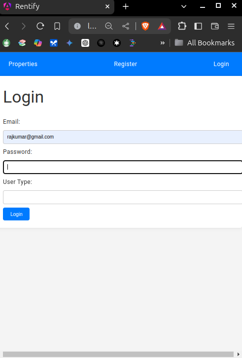

https://github.com/RamkumarMrj/rentify-app





## 1. User Model:

```
{
  "id": "string" (unique identifier for the user),
  "firstName": "string",
  "lastName": "string",
  "email": "string" (unique identifier for login),
  "phoneNumber": "string",
  "userType": "string" ("seller" or "buyer"),
  "password": "string" (hashed and salted for security)
}
```

## 2. Property Model:

```
{
  "id": "string" (unique identifier for the property),
  "sellerId": "string" (foreign key referencing the seller user),
  "place": "string",
  "area": "string" (e.g., square footage),
  "bedrooms": "number",
  "bathrooms": "number",
  "amenities": "array of strings" (e.g., hospitals, colleges, etc.),
  "description": "string" (optional, for additional details),
  "likeCount": "number",
  "createdAt": "string" (timestamp of property creation),
  "updatedAt": "string" (timestamp of last property update)
}
```

## 3. Login Request (POST):

```
{
  "email": "string",
  "password": "string"
}
```

## 4. Login Response (Success):

```
{
  "token": "string" (JWT for authenticated access),
  "user": {
    "id": "string",
    "firstName": "string",
    "lastName": "string",
    "email": "string",
    "userType": "string"
  }
}
```

## 5. Login Response (Failure):

```
{
  "message": "Invalid email or password"
}
```

## 6. Registration Request (POST):

```
{
  "firstName": "string",
  "lastName": "string",
  "email": "string",
  "phoneNumber": "string",
  "userType": "string" ("seller" or "buyer"),
  "password": "string"
}
```

## 7. Registration Response (Success):

```
{
  "message": "Registration successful"
}
```

## 8. Registration Response (Failure):

```
{
  "message": "Email already in use"
}
```

## 9. Get Properties Response (GET):

```
{
  "properties": [
    {
      "id": "string",
      "sellerId": "string",
      "place": "Bangalore",
      "area": "1200 sq ft",
      "bedrooms": 2,
      "bathrooms": 2,
      "amenities": ["Hospitals", "Colleges"],
      "description": "Spacious apartment in a prime location...",
      "likeCount": 10,
      "createdAt": "2024-05-24T12:00:00Z",
      "seller": {
        "id": "string",
        "firstName": "John",
        "lastName": "Doe"
      }
    }
  ]
}
```

## 10. Get Property Details Response (GET):

```
{
  "property": {
    "id": "string",
    "sellerId": "string",
    "place": "Bangalore",
  }
}
```

## 11. Update Property Request (PUT/PATCH):

```
{
  "place": "Chennai",
  "description": "Updated property description..."
}
```

## 12. Update Property Response (Success):

```
{
  "message": "Property updated successfully"
}
```

## 13. Update Property Response (Failure):

```
{
  "message": "string" (e.g., "Unauthorized access" or "Property not found")
}
```

## 14. Delete Property Request (DELETE):

Note: Implement security measures to prevent unauthorized deletion.

## 15. Delete Property Response (Success):

```
{
  "message": "Property deleted successfully"
}
```

## 16. Delete Property Response (Failure):

```
{
  "message": "string" (e.g., "Unauthorized access" or "Property not found")
}
```

## 17. Like Property Request (PUT):

Note: This endpoint might need additional logic to handle situations like preventing a user from liking the same property repeatedly.

## 18. Like Property Response (Success):

```
{
  "property": {
    "id": "string",
    "likeCount": 12
  }
}
```

## 19. Like Property Response (Failure):

```
{
  "message": "Unauthorized access",
  "message-not": "Property not found"
}
```

## 20. Send Email Notification Request (POST) (Optional):

**Request Body:**

This might require a specific format depending on the email API you use (e.g., SendGrid, Mailgun). It could potentially include:

- `recipientEmail` (buyer email)
- `sellerEmail` (seller email)
- `propertyDetails` (relevant property information)

**Response:**

The response structure will depend on the chosen email API, but it should indicate success or failure of the email sending process.

**Additional Considerations:**

- Error handling: Implement proper error handling throughout your API for various scenarios (e.g., invalid data, unauthorized access, resource not found).
- Security: Secure your backend API using authentication, authorization, and input validation.
- Pagination: Consider implementing pagination parameters in the `Get Properties` endpoint to manage large datasets efficiently.
- Filtering: If implementing property filtering, define the filter criteria in the `Get Properties` endpoint.
